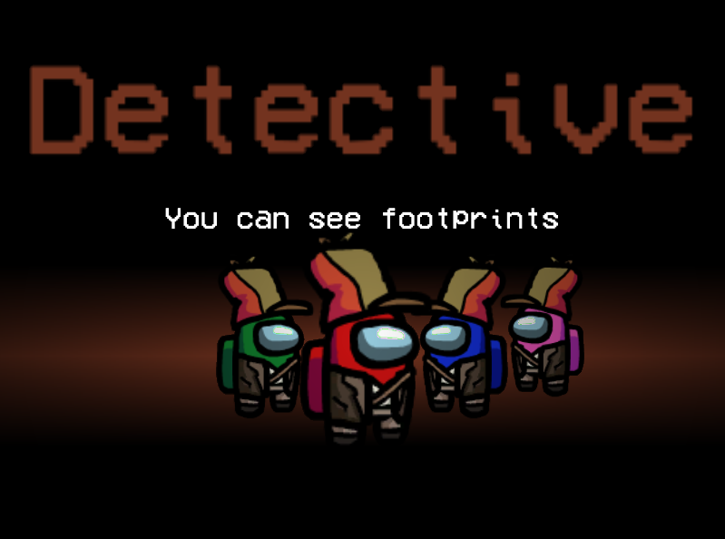

# Town Of Impostors: Reborn

 We will have a discord server where you can find games to play with other people, chat, talk about the mod, and more soon!

---

Town Of Impostors: Reborn is a mod for Among Us - <b>PC/Windows (Steam)</b>. This mod aims to add new roles, modifiers & abilities to enhance gameplay, while also providing a full range of options to allow for customising and playing games your way.

<b>Every player in the room must have the mod installed for it to work correctly. Please DO NOT play this mod on public lobbies, it is intended for private organised lobbies.</b>

---

Crewmate Roles
================

---

Neutral Roles
=================

---

Modifiers
=============

 
 
 

---

Impostor Roles
=================

 
 
 
 
 
 

---

Roles & Modifiers
======================
  * [Roles, Abilities, Modifiers & Custom Options](#roles-abilities-modifiers--custom-options)
    * [Crewmate Team](#crewmate-team)
      * [Sheriff](#sheriff)
      * [Doctor](#doctor)
      * [Agent](#agent)
      * [Detective](#detective)
      * [Plumber](#plumber)
      * [Informant](#informant)
      * [Trickster](#trickster)
      * [Operative](#operative)
      * [Mayor](#mayor)
    * [Other Teams](#other-teams)
      * [Jester](#jester)
      * [Arsonist](#arsonist)
      * [Impostor](#impostor-team)
    * [Modifiers](#modifiers)
      * [Lovers](#lovers)
      * [Giant](#giant)
      * [Tiny](#tiny)
      * [Nightowl](#nightowl)
    * [How Role Assignment Works](#how-does-role-assignment-work)

Other
========
  * [FAQ](#faq)
  * [Troubleshooting](#troubleshooting)
    * [Known Issues](#known-issues)
  * [License](#license)
  * [Installation](#installation)
    * [Releases and Compatibility](#releases-and-compatibility)
    * [Saving and Loading Settings](#saving-and-loading)
    * [Updating](#updating-the-mod)
  
---

<h1 id="installation">Installation</h1>

- If you are updating your Town Of Impostors version, please hop to this section [here](#updating-the-mod).

- Coming Soon

If you have any issues, please take a look at the <a href="#troubleshooting">troubleshooting section</a>.
 
<h2>Releases and Compatibility</h2>

<table style="width:100%">
  <tr>
    <th>Among Us Version</th>
    <th>Mod Version</th>
    <th>Link</th>
  </tr>
 <tr>
    <td>v2025.3.25e (v16.0.2)</td>
    <td>v0.0.1b</td>
    <td><a href="">Download</></td></td>
   </tr>
</table>
 
### Updating the Mod
- Coming Soon

---

# Roles, Abilities, Modifiers & Custom Options

### Keybindings
From 1.6.0 onwards, you can now use keys **1, 2, 3, 4, Z, X** to activate abilities.

### Gamemodes
- **Map Randomise Mode:** When toggled on, map will be randomised upon starting the game
- **All Crewmates Must Die Mode:** When toggled on, game will continue as long as a crewmate is alive (special win conditions still occur for Jester, Arsonist and Lovers)
- **Game Continues With Arsonist:** Toggles whether the game should continue as long as Arsonist is alive

### Extra Settings
- **Custom Role Eject Confirmation:** Enables ejects to show the special role of the player being ejected, assuming "Confirm Ejects" option is on
- **Same Roles Know Each Other:** Allows players of the same role to see each other (via highlighted names)
- **Comms Sabotage Causes Anonymity:** Improves the Comms Sabotage to turn everyone anonymous
- **Ghosts Use Crewmate Vision:** Ghosts will no longer have ghost vision (where they can see everything), they will now instead use normal crewmate vision. Impostors are unaffected. _This option is recommended if there is a Doctor in the game_
- **Disable Body Report:** Toggles on/off body reporting (to get a different kind of gameplay)
- **Dead Player See All Roles:** Toggles whether dead players should see all roles (after a meeting only)
- **Can Vent With Body:** Toggle whether players can vent with bodies
- **% Boddy Drag Speed Modifier:** % Movement Modifier for dragging bodies

## Crewmate Team

The special roles in the Crewmate Team. The goal of the Crewmate Team is to combine their abilities and knowledge to **find the Impostors**. The Crewmate Team will win if all Impostors are ejected or killed.

### Sheriff
The Sheriff is a role that has the ability to kill Impostors. However, if they attempt to kill a fellow crewmate, they will lose their own life instead as a punishment.

Custom Options

  
+ **% Sheriff Chance:** Chance of a Sheriff being added to the role selection pool
+ **# Max Sheriff Count:** The maximum number of Sheriffs that can be added to the role selection pool
+ **Sheriff Kill Cooldown:** Kill cooldown for the Sheriff
+ **Show Sheriff:** Shows the Sheriff to other players (via a highlighted name)
+ **Innocent Target Also Dies:** The Innocent target will also be killed along with the Sheriff
+ **Jester Is Enemy:** Jester will no longer count as "Innocent"
+ **Arsonist Is Enemy:** Arsonist will no longer count as "Innocent"
+ **Sheriff Does Not Die:** Toggles whether Sheriff will die as a punishment or not

### Doctor
The Doctor is a role that has the ability to revive dead players. However, this means they are also able to revive Impostors that have been killed by the Sheriff.

Custom Options

  
+ **% Doctor Chance:** Chance of a Doctor being added to the role selection pool
+ **# Max Doctor Count:** The maximum number of Doctors that can be added to the role selection pool
+ **Doctor Revive Cooldown:** Cooldown for the Doctor Revive Ability
+ **Doctor Revive Time:** The time is takes for a Doctor to successfully revive a player
+ **Start Cooldown On Failed Revives:** Start Revive Ability Cooldown if revive fails (if body is removed or disposed)
+ **Medbay Revive Only:** Only allow revives in the Medbay location of a map
+ **Lose Role On Revive:** Crewmates with special roles lose their role if revived (Does not affect Jester & Arsonist)
+ **Retrieve Body Ability:** Toggle the Retrieve Body Ability
+ **Retreive Body Cooldown:** Cooldown for the Retrieve Body Ability

### Agent
The Agent is a powerful role that has abilities allowing them to access map intel from anywhere. This includes the admin table map, security cameras, door logs and vitals if any are accessible. This gives them much more information on what is going on around the map, but they shouldn't neglect their tasks either.

Custom Options

  
+ **% Agent Chance:** Chance of a Agent being added to the role selection pool
+ **# Max Agent Count:** The maximum number of Agents that can be added to the role selection pool
+ **Agent Tech Cooldown:** The cooldown of Agent's abilities (the cooldowns are separate between the abilities, but they will all have the same cooldown time)
+ **Can Use Admin Map:** Agent can activate Admin Map
+ **Can Use Cameras:** Agent can activate Cameras _(Skeld and Polus Only)_
+ **Can Use Door Logs:** Agent can activate Door Logs _(MIRA HQ Only)_
+ **Can Use Vitals:** Agent can activate Vitals _(Polus Only)_
+ **Agent Abilities Share Cooldown:** Toggle whether all agent abilities go into cooldown after using one ability

### Detective
The Detective is a role that can see footprints and get extra information when reporting bodies (They will get a body report in chat only they can see, which shows time of death and if the body was moved or not). They should use this ability to track down Impostors, but they should also be careful not to frame the wrong person.

Custom Options

  
+ **% Detective Chance:** Chance of a Detective being added to the role selection pool
+ **# Max Detective Count:** The maximum number of Detectives that can be added to the role selection pool
+ **Enable Body Scan Ability:** Toggles body scan ability for Detective
+ **Body Scan Cooldown:** Body scan ability cooldown
+ **Body Scan Radius:** Body scan radius
+ **Footprint Duration:** How long the footprints will last in seconds
+ **Anonymous Footprints:** Whether the footprints should be anonymous or not
+ **Extra Information On Report:** If Detective reports a body, they will get an additional "Body Report" via messages (which only they can see). Shows how long the player has been dead for, as well as whether the body has been moved or not. Also shows whether the body was poisoned.
+ **Killers Leave Bloody Prints:** Killers _(includes both Sheriffs & Impostors)_ will leave bloody footprints after a kill
+ **Bloody Prints Duration:** Duration for how long Killers should have bloody footprints
+ **Disguised Footprints:** Toggles whether Impostors leave behind disguised footprints if they are disguised

### Plumber
The Plumber is a role that can use vents to travel around. They can also stay in vents to observe the room. But they should be careful not to be suspected as the Impostor or noticed by the Impostor.

Custom Options

  
+ **% Plumber Chance:** Chance of a Plumber being added to the role selection pool
+ **# Max Plumber Count:** The maximum number of Plumbers that can be added to the role selection pool
+ **Retrieve Body Ability:** Toggle the Retrieve Body Ability
+ **Retreive Body Cooldown:** Cooldown for the Retrieve Body Ability

### Informant
The Informant is a role that can see other roles after they are finished with ALL their tasks. They will be "Informed" after finishing tasks, but should also be careful of Impostors that are notified about them. The Informant can only be informed or revealed after **completing at least one task**.

**NOTE: Comms Anonymous Sabotage (if toggled on) will prevent Informant from seeing roles, even in meetings. This is the counterplay to Informant.**

Custom Options

  
+ **% Informant Chance:** Chance of a Informant being added to the role selection pool
+ **# Max Informant Count:** The maximum number of Informants that can be added to the role selection pool
+ **Impostors Are Notified:** Toggles whether Impostors will be notified and also have the Informant revealed to them
+ **Tasks Left When Impostors Notified:** How many tasks left for the Informant before Impostors are notified about them
+ **Show Arrows (Informants And Impostors):** Show arrows pointing to Informants/Impostors if either have been revealed. These can only be seen by Informants or Impostors depending on options that are enabled
+ **See Jester After Tasks:** Toggles whether Informants can see Jesters after tasks
+ **See Arsonists After Tasks:** Toggles whether Informants can see Arsonists after tasks
+ **See Crewmate Roles After Tasks:** Toggles whether Informants can see Crewmate special roles _(if any)_ after tasks
+ **Highlight Names In Meetings:** Toggles whether names are highlighted in meetings too _(for Informants & Impostors)_

### Trickster
The Trickster is a role that can create a decoy to trick the Impostor. If the Impostor kills the decoy, they will go into kill cooldown which will slow them down. However, the Sheriff is also able to kill decoys. The Trickster may also swap positions with their decoys to avoid danger or cover more ground quicker.

Custom Options

  
+ **% Trickster Chance:** Chance of a Trickster being added to the role selection pool
+ **# Max Trickster Count:** The maximum number of Tricksters that can be added to the role selection pool
+ **Trickster Decoy Cooldown:** Cooldown duration for the Trickster Decoy ability
+ **Trickster Decoy Duration:** Duration of how long the decoy should last
+ **Enable Trickster Swap Ability:** Allow Trickster to swap positions with the decoy
+ **Trickster Swap Cooldown:** Cooldown duration for the Trickster Swap ability
+ **Trickster Disguise Ability:** Toggles whether triggers can disguise as other players
+ **Trickster Disguise Cooldown:** Cooldown for Trickster disguise
+ **Trickster Disguise Duration:** Duration for Trickster's disguise

### Operative
The Operative is a role that can place down gadgets that allow them to track other players. A sticky tracker can be placed down that'll stick to other players and reveal them for the duration. An AOE sensor can be placed down to reveal players in an area (revealed players will be anonymous) for a duration. **All revealed players will be shown on the map.** The Operative gadgets are only visible to the Operative.

Custom Options

  
+ **% Operative Chance:** Chance of an Operative being added to the role selection pool
+ **# Max Operative Count:** The maximum number of Operatives that can be added to the role selection pool
+ **# Max Tracker Storage:** Maximum number of trackers that can be stored
+ **Tracker Duration:** How long Trackers should last before disappearing
+ **Tracker Cooldown:** Cooldown to gain a tracker charge
+ **# Max Sensor Storage:** Maximum number of sensors that can be stored
+ **Sensor Radius:** Size of the sensor radius for revealing players
+ **Sensor Duration:** How long Sensors should last before disappearing
+ **Sensor Cooldown:** Cooldown to gain a sensor charge
+ **Show Tracking Arrows:** Toggle whether the tracker should also show a tracking arrow when tracking someone
+ **Track Dead Bodies:** Toggle whether trackers/sensors should continue tracking dead players

### Mayor
The Mayor is a role that gets additional votes they can use to influence the results of a meeting. They are able to store votes each meeting and can add votes to any player in the meeting (or skip vote) at any time, as long as they have not locked in their final vote. They should use this if they want to force someone to be voted out or force a skip vote. But they should be careful not to reveal themselves too early.

Custom Options

  
+ **% Mayor Chance:** Chance of a Mayor being added to the role selection pool
+ **Enable Mayor:** Toggle whether Mayor is enabled or not
+ **Mayor Cannot Be Lover:** Toggles whether a Mayor can be lover or not
+ **Starting Vote Bank:** How many votes should Mayor start with
+ **Votes Gained Per Meeting:** How many votes Mayor should gain per meeting
+ **Enable Emergency Ability:** Toggle Mayor's Emergency Meeting Ability
+ **Emergency Ability Cooldown:** Mayor Emergency Meeting Ability cooldown
+ **Emergency Ability Limit:** Maximum number of times Mayor can use the ability

## Neutral Team

### Jester
The Jester is a role with no abilities and no tasks to do (they get fake tasks like Impostors). They are in their own team, and their goal is to get themselves ejected from the ship and make sure not to get killed by the Impostors. They will win instantly if ejected from the ship. However, if they are killed, they will have no way to win and essentially lose. The have extra abilities to help them act suspicious, such as dragging bodies, leaving bloody footprints and using vents.

Custom Options

  
+ **% Jester Chance:** Chance of a Jester being added to the role selection pool
+ **Enable Jester:** Allow Jester to be added to the role selection pool 
+ **Jester Can Fix Sabotages:** Allow Jester to fix sabotages
+ **Jester Wins From Sheriff Kill:** Jester will win if killed by the Sheriff
+ **Jester Bloody Footprints Ability:** Toggles whether the Jester can leave bloody footprints to trick the detective
+ **Jester Body Drag Ability:** Toggles whether the Jester can drag bodies
+ **Jester Can Use Vents:** Toggles whether the Jester can use vents
+ **Retrieve Body Ability:** Toggle the Retrieve Body Ability
+ **Retreive Body Cooldown:** Cooldown for the Retrieve Body Ability

### Arsonist
The Arsonist is a role that aims to douse everyone alive and igniting them all to win alone. They need to do this before the Crewmate Team wins by finding all the Impostors. They have no tasks (they get fake tasks like Impostors), but should be careful not to be suspected as they have to say close for the duration of time they are dousing. They should also be careful not to be killed by the Impostor.

Custom Options

  
+ **% Arsonist Chance:** Chance of a Arsonist being added to the role selection pool
+ **Enable Arsonist:** Allow Arsonist to be added to the role selection pool 
+ **Douse Time:** How long it takes for Arsonist to douse a target
+ **Arsonist Can Fix Sabotages:** Toggles whether Arsonists can fix sabotages
+ **Arsonist Must Refuel:** Toggles whether Arsonists must refuel after set amount of douses
+ **# Douses Stored:** Number of successful Douses before Arsonists must refuel _(if refuel option is toggled on)_

## Impostor Team

### New Abilities:
- Drag & Drop Bodies - The Impostor may now drag & drop bodies to reposition them, bodies may also be dragged through vents
- Dispose Body - The Impostor can dispose a body they are dragging, if they are close to or inside a vent. A bloodstain is left behind to give crewmates a clue
- Disguise/Sample DNA - The Impostor can disguise as another player, by first sampling their DNA
- Decoy - The Impostor can drop a decoy, much like the Trickster, and can drop decoys of other players by first disguising as them
- Swap - The Impostor can swap positions with their decoy
- Blind Trap - The Impostor can leave blind traps that will blind players that walk on it
- Poison - The Impostor can poison a player, they will die after a set duration

### Impostor Settings

  

Custom Options

  
+ **Enable Impostor Roles:** Enable separate Impostor roles. If this is toggled off, the Impostor is a "Super Impostor" with all abilities
+ **Enable Impostor Abilities:** This option is available is Impostor Roles is toggled off. Enables/Disables abilities for the normal Impostor
+ **Impostors Can Kill Each Other:** Allows Impostors to target and kill each other
+ **Impostors Do Not Know Each Other:** Toggles whether Impostors know each other
+ **Impostors Can Kill Inside Vents:** Toggles whether Impostors can kill any other players inside of vents (if they are in the vent too)
+ **Enable Impostor Messaging:** Toggle on/off Impostor Comms. Impostor Comms allows Impostors to chat to each other in-game via the chat messaging system, outside of meetings

### Dragger
The Dragger is an Impostor role that can drag & drop dead bodies. They are also able to dispose the dead bodies in vents.

Custom Options

  
+ **% Dragger Chance:** Chance of a Dragger being added to the role selection pool
+ **Dragger Count:** The maximum number of Draggers that can be added to the role selection pool
+ **Drag And Drop Ability:** Toggle the Drag and Drop Ability
+ **Dispose Body Ability:** Toggle the Dispose Body Ability
+ **Dispose Body Cooldown:** Cooldown for the Dispose Body Ability
+ **Retrieve Body Ability:** Toggle the Retrieve Body Ability
+ **Retreive Body Cooldown:** Cooldown for the Retrieve Body Ability
+ **Vents Hold Multiple Bodies:** Toggles whether multiple bodies can be disposed in one vent (default is 1 body maximum if toggled off)

### Morphling
The Morphling is an Impostor role that can sample DNA of other players and disguise into them, confusing everyone.

Custom Options

  
+ **% Morphling Chance:** Chance of a Morphling being added to the role selection pool
+ **Morphling Count:** The maximum number of Morphlings that can be added to the role selection pool
+ **Disguise Ability:** Toggle the Disguise Ability
+ **Disguise Cooldown:** Cooldown for the Disguise Ability
+ **Disguise Duration:** How long the Disguise lasts for in seconds

### Deceiver
The Deceiver is an Impostor role that can leave decoys and swap to them, confusing players and allowing them to reposition themselves.

Custom Options

  
+ **% Deceiver Chance:** Chance of a Deceiver being added to the role selection pool
+ **Deceiver Count:** The maximum number of Deceivers that can be added to the role selection pool
+ **Enable Decoy Ability:** Toggle the Decoy Ability for Impostors
+ **Decoy Cooldown:** Cooldown for the Decoy ability
+ **Decoy Duration:** Duration for how long the Decoy will last
+ **Enable Decoy Swap Ability:** Toggle the Decoy Swap Ability for Impostors
+ **Decoy Swap Cooldown:** Cooldown for the Decoy Swap Ability

### Viper
The Viper is an Impostor role that can blind and poison other players.

Custom Options

  
+ **% Viper Chance:** Chance of a Viper being added to the role selection pool
+ **Viper Count:** The maximum number of Vipers that can be added to the role selection pool
+ **Blind Trap Ability:** Toggle the blind trap ability
+ **Blind Trap Charges:** Max charges of blind traps Viper can hold
+ **Blind Trap Cooldown:** Blind trap cooldown to regain a charge
+ **Blind Trap Duration:** How long the blind trap should last
+ **Blind Duration:** How long players are blinded for
+ **Poison Ability:** Toggle the poison ability
+ **Poison Duration:** Duration before player is killed by poison
+ **Poison Additional Kill Cooldown:** How much extra cooldown is added to the kill button
+ **Poison Cure Duration:** How long it takes to cure the poison in medbay
+ **Poison Continues In Meeting:** Toggles whether Poison Timer should continue ticking in meetings

### Sniper
The Sniper has the ability to kill players during meetings if they are able to guess their roles. But they may be punished for wrong guesses. They may also use a Sniper in-game if toggled on. (Note: Sniper Rotation is not synced between players, so you will not see where the player is aiming)

**REMINDER:** Toggling on the Sniper Rifle will hide/replace the original Kill Button

Custom Options

  
+ **% Sniper Chance:** Chance of a Sniper being added to the role selection pool
+ **Sniper Count:** The maximum number of Snipers that can be added to the role selection pool
+ **Max Snipe Per Meeting:** The number of times the Sniper can attempt to kill players in meetings with role guesses
+ **Sniper Dies On Wrong Guess:** Punish the Sniper with death if they guess wrong
+ **Sniper Rifle Ability:** Toggled On/Off the Sniper Rifle to use between meetings, a long range killing ability _**(NOTE: This hides/replaces the normal kill)**_
+ **Sniper Rifle Cooldown:** Cooldown for Sniper Rifle Shots
+ **Rifle Unholster Cooldown:** Cooldown to unholster the Sniper Rifle
+ **Rifle Holster Cooldown:** Cooldown to holster the Sniper Rifle
+ **Gunshot Revealed Duration:** Duration for how the Sniper Shot Reveal Arrow lasts

**If seperate Impostor Roles are disabled, the normal Impostors will use all abilities (configured with the same custom options as the separate roles). Basically every Impostor is a "Predator"**

## If separate Impostor Roles are enabled:
### Tier 1 Impostors:
- **Dragger** has the drag/drop & dispose body abilities
- **Morphling** has the sample & disguise abilities
- **Deceiver** has the decoy & swap abilities
- **Viper** has the blind trap & poison abilities

### Tier 2 Impostors:
- **Hitman** has the combined abilities of Dragger and Morphling
- **Joker** has the combined abilities of Morphling and Deceiver
- **Assassin** has the combined abilities of Dragger and Viper

### Tier 3 Impostors:
- **Predator** has the abilities of all Impostor roles

**Any Impostor without a special Impostor role will be a normal vanilla Impostor with no abilities. Impostor Role abilities are configured with the same options used to configure the normal Impostor**

## Modifiers

### Lovers
This activates the Lovers modifier. Two players are selected as random to be lovers (if applicable). Impostors can also be selected as Lovers. Jesters & Arsonists cannot be selected as Lovers. There can not be more than 1 Impostor Lover.

Lovers can still get their own special roles, and can still win as normal with their respective teams.

However, the Lovers can achieve a special "Lovers Win". The goal of the Lovers is to stay alive together and win together at the end. Lovers will achieve the special Lovers Win if they are both among the **last 3 players** standing. The only exception to this is if the custom option **Game Continues With Arsonist** is toggled on and the Arsonist is among the last 3. The game will continue as long as the Arsonist is alive.

Lovers are given the ability to chat with each other via a special Lovers Chat in-between meetings.

Custom Options

  
+ **% Lovers Chance:** Chance for Lovers to appear
+ **Enable Lovers:** Toggles Lovers on/off
+ **Lovers Die Together:** Toggles whether Lovers should die together (if one dies, the other dies, like a life link)

### Giant
This activates the Giant modifier. A Giant player will have a larger sight radius to see more things, but will suffer from slower movement speed.

Custom Options

  
+ **% Giant Chance:** Chance for Giant to appear
+ **Enable Giant:** Toggles Giant on/off
+ **% Movement Modifier:** Percentage movement modifier for Giant
+ **% Vision Modifier:** Percentage vision modifier for Giant

### Tiny
This activates the Tiny modifier. A Tiny player will be able to move around faster, but will suffer from lower vision (opposite of Giant)

Custom Options

  
+ **% Tiny Chance:** Chance for Tiny to appear
+ **Enable Tiny:** Toggles Tiny on/off
+ **% Movement Modifier:** Percentage movement modifier for Tiny
+ **% Vision Modifier:** Percentage vision modifier for Tiny

### Nightowl
This activates the Nightowl modifier. A Nightowl will be able to see better when lights are out compared to other players, but will suffer from worse vision when lights are on.

Custom Options

  
+ **% Nightowl Chance:** Chance for Nightowl to appear
+ **Enable Nightowl:** Toggles Nightowl on/off
+ **% Lights On Vision Modifier:** Percentage Lights On Vision modifier for Nightowl
+ **% Lights Off Vision Modifier:** Percentage Lights Off Vision modifier for Nightowl

# How does role assignment work?
The role selection works as follows:
For each role, it will attempt to add that to the selection pool **X** number of times, where **X** is the maximum count. The chance of the role being added to the selection pool each time is based on the percentage chance set in the custom options for the specified role.

Once the selection pool is filled, the roles in there will then be randomly assigned to Crewmates (who are not already Impostors and don't already have a special role). As long as there are roles in the pool to assign and Crewmates to assign them to, they will be assigned out. If there are no more roles to be assigned out, the remaining players will just stay as normal Crewmates.

Example:
_**Sheriffs - # Max Count: 3 | % Chance: 50**_

This means that the role selection will try to put 3 sheriffs into the pool, at 50% chance each time. So the pool can end up with 0, 1, 2 or even the maximum of 3 Sheriffs.

---

# FAQ
 
### Can you play Proximity Chat (Crewlink) with it?
Yes, Better-Crewlink supports Among Us Modifications

### Can this mod work with other mods?
I cannot guarantee that this mod will work with other mods. There will likely be conflicts. You will have to test yourself. 

### Do my friends need to install the mod to play it together?
Yes. Every player in the lobby must have the mod installed. Please don't use and play mods in unorganised public lobbies.

### Can this mod work with controllers?
This mod was not made to be compatible with controllers in mind; it was intended to be played with keyboard and mouse.

---

<h1 id="troubleshooting">Troubleshooting</h1>

### The mod isn't installed or game doesn't launch
- Please make sure you're using the latest version of the mod and the correct version of Among Us for it
- Please make sure you're using Windows, this mod is not compatible on Android, Mac or any other OS/devices
- Please make sure you're using this with the **Steam** version of Among Us; this is not compatible with the itch.io version unfortunately
- Please make sure you're not loading other mods along with this one
- The first time launching the mod may take a while, so please allow a minute before worrying that nothing is appearing. If nothing has happened for a while, please open your Task Manager (CTRL+ALT+DEL) and close the Among Us process, then attempt launching again.
- Make sure you have followed all the <a href="#installation">installation steps</a>, especially launching the game via the Among Us.exe file in the modified game directory.
- Try uninstalling the mod (see uninstalling the mod in the Installation Steps) and following the installation steps again
- If you're using a Mod Manager to install the mod, it is not guaranteed to work
- You might be missing some cpp libs (software libraries used by the mod); please install Visual C++ redistributable packages [x86](https://aka.ms/vs/16/release/vc_redist.x86.exe) & [x64](https://aka.ms/vs/16/release/vc_redist.x64.exe)

### The mod still doesn't work or found a bug?
You can <a href="https://github.com/AJMix/TownOfImpostors/issues/new">raise an issue within GitHub</a> documenting your issue. You will need to be logged into GitHub to do this.
For any bugs, take a quick check if your bug has already been listed under the below [Known Issues](#known-issues) or if it has already been reported. Please give as much detail as possible regarding the issue, including steps to reproduce it if possible. If it exists, please also attach your **LogOutput.log**, generated in the Among Us\BepInEx\ folder.

## Known Issues
- When updating from version to version, settings can bug and cause unintended effects. This is due to how new custom settings are being added in each update. If you are getting strange bugs occurring with the settings, try manually settings everything again (to overwrite the saved settings on your computer) by manually toggling options on and off, setting timers and settings counts. You can also do a hard reset by running vanilla among us and creating a lobby, then reopening among us with this mod. In v1.5.0 onwards, there is a new reset settings button the host can make use of to do a hard reset on all custom settings to reset everything to default values

- Disconnections in the middle of the game can cause bugs to occur, and the only way to fix them would be starting a new game or restarting the game. This mod was made with the assumption that no one would disconnect as disconnections are a whole other edgecase to fix. Future updates will hopefully fix this, but for now, just start another game or restart the client if a disconnection causes your game to bug

---

<h1>License</h1>
<a href="https://github.com/BepInEx/BepInEx">BepinEx</a> is distributed under <b>LGPL-2.1</b> License.

